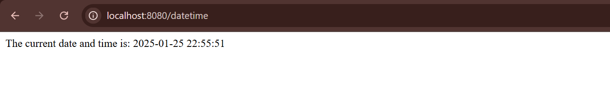

# spring-boot-date-time
This is a simple Spring Boot application that provides the current date and time at the `/datetime` endpoint.

## Project Structure
- **`DateandtimeApplication.java`**: The main entry point of the Spring Boot application.

- **`DateTimeController.java`**: A REST controller that defines the `/datetime` endpoint to return the current date and time.

## Example Output
When you visit the `/datetime` endpoint, you’ll get:

